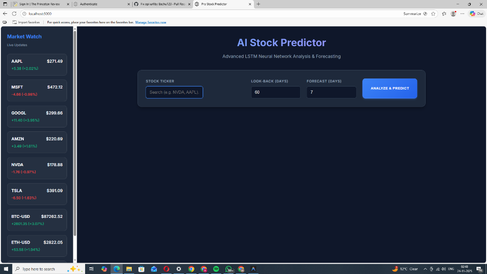

# Stock Price Prediction Web App



A simple web application that uses an LSTM (Long Short-Term Memory) neural network to predict stock prices. Built with Flask, TensorFlow/Keras, and Chart.js.

## Features
- **Stock Data**: Fetches live historical data using `yfinance`.
- **Deep Learning**: Uses an LSTM model to learn from historical trends.
- **Interactive UI**: Clean, responsive interface to input ticker and parameters.
- **Visualization**: Interactive charts showing historical data, model validation (test set), and future predictions.

## Prerequisites
- Python 3.8 or higher
- pip (Python package installer)

## Installation

1. **Clone or Download** the project folder.

2. **Create a Virtual Environment** (Recommended):
   ```bash
   # Windows
   python -m venv venv
   venv\Scripts\activate

   # Mac/Linux
   python3 -m venv venv
   source venv/bin/activate
   ```

3. **Install Dependencies**:
   ```bash
   pip install -r requirements.txt
   ```
   *Note: This installs Flask, pandas, numpy, yfinance, tensorflow, and scikit-learn.*

## How to Run

1. **Start the Flask App**:
   ```bash
   
   ```

2. **Open in Browser**:
   Go to [http://127.0.0.1:5000](http://127.0.0.1:5000)

3. **Use the App**:
   - Enter a stock ticker (e.g., `AAPL`, `GOOGL`, `TSLA`).
   - Adjust "Training Days" (how many past days the model looks at to predict the next one).
   - Adjust "Prediction Days" (how many days into the future to forecast).
   - Click **Predict Price**.
   - Wait for the model to train (this may take a few seconds to a minute depending on your hardware).

## Project Structure
- `app.py`: Main Flask application.
- `models/stock_model.py`: Contains the logic for fetching data, preprocessing, and the LSTM model.
- `templates/index.html`: The HTML frontend.
- `static/`: Contains `style.css` and `script.js`.
